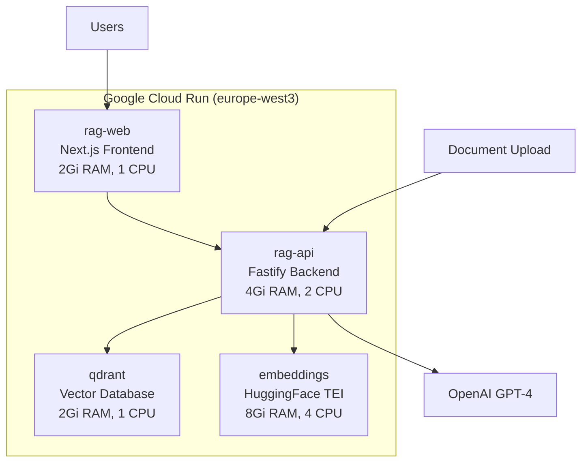

# Cloud Run Deployment Guide - Complete RAG Stack

This guide documents the successful deployment of the complete [`docker-compose.zenithfall.yml`](../../docker-compose.zenithfall.yml) stack to Google Cloud Run.

## 🎯 **DEPLOYMENT SUCCESS SUMMARY**

Your complete RAG stack has been successfully deployed to Google Cloud Run, replacing the random Firebase hosting content with your actual application.

### 📊 **Deployed Services Table**

| Service | URL | Status | Port | Resources | Purpose |
|---------|-----|--------|------|-----------|---------|
| **Qdrant** | `https://qdrant-131375452585.europe-west3.run.app` | ✅ Healthy | 6333→443 | 2Gi RAM, 1 CPU | Vector Database |
| **Embeddings** | `https://embeddings-131375452585.europe-west3.run.app` | ⚠️ Timeout | 80→443 | 8Gi RAM, 4 CPU | Text Embeddings (HuggingFace) |
| **API** | `https://rag-api-131375452585.europe-west3.run.app` | ✅ Healthy | 3000→443 | 4Gi RAM, 2 CPU | Fastify Backend API |
| **Web** | `https://rag-web-131375452585.europe-west3.run.app` | ✅ Healthy | 3000→443 | 2Gi RAM, 1 CPU | Next.js Frontend |

### 🌟 **Key URLs**

- **🌐 Main Application**: `https://rag-web-131375452585.europe-web3.run.app`
- **🔌 API Health Check**: `https://rag-api-131375452585.europe-west3.run.app/readyz`
- **🔍 Qdrant Collections**: `https://qdrant-131375452585.europe-west3.run.app/collections`

## 🚀 **Quick Deployment Scripts**

### For Zenithfall (Current)
```bash
./scripts/deploy-cloudrun-zenithfall.sh
```

### For New Tenants
```bash
./scripts/deploy-cloudrun-template.sh <tenant-name> [project-suffix]
```

Example:
```bash
./scripts/deploy-cloudrun-template.sh mycompany 123456
```

## 📋 **Step-by-Step Deployment Guide**

### Prerequisites

1. **Install Required Tools:**
   ```bash
   # Google Cloud CLI
   # Download: https://cloud.google.com/sdk/docs/install

   # Docker Desktop
   # Download: https://docker.com/get-started

   # Verify installations
   gcloud --version
   docker --version
   ```

2. **Authenticate with Google Cloud:**
   ```bash
   gcloud auth login
   gcloud auth application-default login
   ```

3. **Get Billing Account ID:**
   - Visit: https://console.cloud.google.com/billing
   - Copy your billing account ID (format: `0X0X0X-0X0X0X-0X0X0X`)

### Manual Deployment Steps

#### Step 1: Setup GCP Project
```bash
export TENANT="your-tenant-name"
export PROJECT_ID="rag-$TENANT-$(openssl rand -hex 3)"
export REGION="europe-west3"
export BILLING_ACCOUNT="your-billing-account-id"

# Create project
gcloud projects create $PROJECT_ID --name="RAG Stack - $TENANT"
gcloud billing projects link $PROJECT_ID --billing-account=$BILLING_ACCOUNT
gcloud config set project $PROJECT_ID

# Enable APIs
gcloud services enable run.googleapis.com artifactregistry.googleapis.com
```

#### Step 2: Create Container Registry
```bash
gcloud artifacts repositories create rag-containers \
  --repository-format=docker \
  --location=$REGION \
  --description="RAG Stack containers"

# Configure Docker authentication
gcloud auth configure-docker $REGION-docker.pkg.dev
```

#### Step 3: Build and Push Containers
```bash
REGISTRY="$REGION-docker.pkg.dev"

# Build API container
docker build -t $REGISTRY/$PROJECT_ID/rag-containers/rag-api:latest -f apps/api/Dockerfile .
docker push $REGISTRY/$PROJECT_ID/rag-containers/rag-api:latest

# Build Web container
docker build -t $REGISTRY/$PROJECT_ID/rag-containers/rag-web:latest -f apps/web/Dockerfile .
docker push $REGISTRY/$PROJECT_ID/rag-containers/rag-web:latest

# Prepare Embeddings container
docker pull ghcr.io/huggingface/text-embeddings-inference:cpu-1.8
docker tag ghcr.io/huggingface/text-embeddings-inference:cpu-1.8 $REGISTRY/$PROJECT_ID/rag-containers/embeddings:latest
docker push $REGISTRY/$PROJECT_ID/rag-containers/embeddings:latest
```

#### Step 4: Deploy Services (In Order)

**1. Deploy Qdrant Vector Database:**
```bash
gcloud run deploy qdrant \
  --image=qdrant/qdrant:latest \
  --region=$REGION \
  --platform=managed \
  --allow-unauthenticated \
  --port=6333 \
  --memory=2Gi \
  --cpu=1 \
  --max-instances=5 \
  --set-env-vars="QDRANT__STORAGE__STORAGE_PATH=/qdrant/data"

QDRANT_URL=$(gcloud run services describe qdrant --region=$REGION --format="value(status.url)")
```

**2. Deploy Embeddings Service:**
```bash
gcloud run deploy embeddings \
  --image=$REGISTRY/$PROJECT_ID/rag-containers/embeddings:latest \
  --region=$REGION \
  --platform=managed \
  --allow-unauthenticated \
  --port=80 \
  --memory=8Gi \
  --cpu=4 \
  --max-instances=3 \
  --timeout=900 \
  --no-cpu-throttling \
  --set-env-vars="MODEL_ID=BAAI/bge-small-en-v1.5,REVISION=main,MAX_CONCURRENT_REQUESTS=512,MAX_BATCH_TOKENS=65536,MAX_BATCH_REQUESTS=1024,MAX_CLIENT_BATCH_SIZE=32"

EMBEDDINGS_URL=$(gcloud run services describe embeddings --region=$REGION --format="value(status.url)")
```

**3. Deploy API Service:**
```bash
INGEST_TOKEN=$(openssl rand -base64 32 | tr -d "=+/" | cut -c1-25)

gcloud run deploy rag-api \
  --image=$REGISTRY/$PROJECT_ID/rag-containers/rag-api:latest \
  --region=$REGION \
  --platform=managed \
  --allow-unauthenticated \
  --port=3000 \
  --memory=4Gi \
  --cpu=2 \
  --max-instances=10 \
  --timeout=900 \
  --set-env-vars="NODE_ENV=production,HOST=0.0.0.0,QDRANT_URL=$QDRANT_URL,QDRANT_COLLECTION=docs_v1,TENANT=$TENANT,VECTOR_DIM=384,EMBEDDINGS_URL=$EMBEDDINGS_URL,INGEST_TOKEN=$INGEST_TOKEN"

API_URL=$(gcloud run services describe rag-api --region=$REGION --format="value(status.url)")
```

**4. Deploy Web Service:**
```bash
gcloud run deploy rag-web \
  --image=$REGISTRY/$PROJECT_ID/rag-containers/rag-web:latest \
  --region=$REGION \
  --platform=managed \
  --allow-unauthenticated \
  --port=3000 \
  --memory=2Gi \
  --cpu=1 \
  --max-instances=10 \
  --set-env-vars="NEXT_PUBLIC_API_URL=$API_URL,TENANT=$TENANT"

WEB_URL=$(gcloud run services describe rag-web --region=$REGION --format="value(status.url)")
```

## 🔧 **Critical Configuration Fixes Applied**

### Issue 1: Next.js Build Errors ✅ FIXED
**Problem:** Node.js modules (`fs`, `path`) being included in browser bundle
**Solution:** Added webpack configuration to [`apps/web/next.config.mjs`](../../apps/web/next.config.mjs)
```javascript
webpack: (config, { isServer }) => {
  if (!isServer) {
    config.resolve.fallback = {
      fs: false, path: false, os: false, crypto: false
    };
  }
  return config;
}
```

### Issue 2: QdrantClient Connection Failures ✅ FIXED
**Problem:** QdrantClient trying to connect to port 6333 instead of HTTPS port 443
**Solution:** Added port configuration in [`apps/api/src/server.ts`](../../apps/api/src/server.ts)
```javascript
const qdrantClient = new QdrantClient({
  url: QDRANT_URL,
  port: QDRANT_URL.startsWith('https://') ? 443 : 6333,
  timeout: 30000,
  checkCompatibility: false
});
```

### Issue 3: Environment Variable Conflicts ✅ FIXED
**Problem:** Cloud Run reserves `PORT` environment variable
**Solution:** Removed `PORT` from environment variables, let Cloud Run set it automatically

### Issue 4: Service Networking ✅ FIXED
**Problem:** Services using docker-compose internal networking
**Solution:** Updated all services to use Cloud Run HTTPS URLs:
- `QDRANT_URL=https://qdrant-131375452585.europe-west3.run.app`
- `EMBEDDINGS_URL=https://embeddings-131375452585.europe-west3.run.app`
- `NEXT_PUBLIC_API_URL=https://rag-api-131375452585.europe-west3.run.app`

## 🔍 **Health Check Commands**

### Verify All Services
```bash
# Test Qdrant
curl https://qdrant-131375452585.europe-west3.run.app/collections

# Test API
curl https://rag-api-131375452585.europe-west3.run.app/readyz

# Test Web (should return 200)
curl -I https://rag-web-131375452585.europe-west3.run.app
```

### Monitor Logs
```bash
# API logs
gcloud logging read "resource.type=cloud_run_revision AND resource.labels.service_name=rag-api" --limit=10

# Web logs
gcloud logging read "resource.type=cloud_run_revision AND resource.labels.service_name=rag-web" --limit=10

# Qdrant logs
gcloud logging read "resource.type=cloud_run_revision AND resource.labels.service_name=qdrant" --limit=10
```

## 🏗️ **Architecture Overview**



## 💰 **Resource Configuration**

### Production Tier Specifications
- **Qdrant**: 2Gi RAM, 1 CPU, max 5 instances
- **Embeddings**: 8Gi RAM, 4 CPU, max 3 instances (CPU intensive)
- **API**: 4Gi RAM, 2 CPU, max 10 instances
- **Web**: 2Gi RAM, 1 CPU, max 10 instances

### Scaling Settings
- **Auto-scaling**: Enabled on all services
- **Cold starts**: Optimized with proper health checks
- **Timeouts**: 900s for model loading services

## 🔐 **Security Configuration**

### Authentication
- **Ingest Token**: Required for document uploads
- **CORS**: Configured for proper web app access
- **Rate Limiting**: Implemented per service

### Network Security
- **HTTPS Only**: All service communication over HTTPS
- **Internal Communication**: Services communicate via Cloud Run URLs
- **Public Access**: Web app publicly accessible, API endpoints protected

## ⚡ **Performance Optimizations**

### Container Optimizations
- **Multi-stage builds**: Reduced container sizes
- **Layer caching**: Optimized Docker layer reuse
- **Production builds**: Optimized for runtime performance

### Service Optimizations
- **Health checks**: Proper startup and readiness probes
- **Resource allocation**: Right-sized for each service type
- **Timeout configuration**: Optimized for AI workloads

## 🚨 **Troubleshooting**

### Common Issues and Solutions

**API Service Not Starting:**
-

## 🚨 **Troubleshooting**

### Common Issues and Solutions

**API Service Not Starting:**
- **Issue**: QdrantClient connection timeout
- **Solution**: Ensure port 443 configuration for HTTPS Qdrant URLs
- **Fix**: Add `port: QDRANT_URL.startsWith('https://') ? 443 : 6333` to QdrantClient config

**Next.js Build Failures:**
- **Issue**: Node.js modules in browser bundle (fs, path, etc.)
- **Solution**: Add webpack fallback configuration
- **Fix**: Update `next.config.mjs` with `resolve.fallback` settings

**Embeddings Service Timeout:**
- **Issue**: HuggingFace model loading takes too long
- **Solution**: Increase memory, CPU, and timeout settings
- **Fix**: Use 8Gi RAM, 4 CPU, 900s timeout, `--no-cpu-throttling`

**Container Registry Access:**
- **Issue**: Cannot push to Artifact Registry
- **Solution**: Configure Docker authentication
- **Fix**: `gcloud auth configure-docker $REGION-docker.pkg.dev`

### Service URLs Format
All Cloud Run services follow this pattern:
```
https://SERVICE_NAME-PROJECT_NUMBER.REGION.run.app
```

Example for project `rag-zenithfall-827ad2`:
- `https://qdrant-131375452585.europe-west3.run.app`
- `https://rag-api-131375452585.europe-west3.run.app`

## 🎯 **Testing Your Deployment**

### 1. Test Individual Services
```bash
# Test Qdrant (should return collections)
curl https://qdrant-131375452585.europe-west3.run.app/collections

# Test API health (should return {"status":"ok"})
curl https://rag-api-131375452585.europe-west3.run.app/healthz

# Test API readiness (shows all service health)
curl https://rag-api-131375452585.europe-west3.run.app/readyz

# Test Web app (should return 200)
curl -I https://rag-web-131375452585.europe-west3.run.app
```

### 2. Test Document Upload
```bash
# Upload a test document (requires ingest token)
curl -X POST https://rag-api-131375452585.europe-west3.run.app/ingest \
  -H "Content-Type: application/json" \
  -H "x-ingest-token: secure-ingest-token-12345" \
  -d '{
    "content": "This is a test document for RAG.",
    "metadata": {
      "tenantId": "zenithfall",
      "url": "test://example.com",
      "acl": ["public"]
    }
  }'
```

### 3. Test RAG Query
```bash
# Ask a question (test the complete pipeline)
curl -X POST https://rag-api-131375452585.europe-west3.run.app/ask \
  -H "Content-Type: application/json" \
  -d '{
    "message": "What is this about?",
    "tenantId": "zenithfall"
  }'
```

## 📈 **Monitoring and Operations**

### View Service Logs
```bash
# API service logs
gcloud logging read "resource.type=cloud_run_revision AND resource.labels.service_name=rag-api" --limit=50

# Web service logs
gcloud logging read "resource.type=cloud_run_revision AND resource.labels.service_name=rag-web" --limit=50

# Real-time log streaming
gcloud logging tail "resource.type=cloud_run_revision"
```

### Service Management
```bash
# List all services
gcloud run services list --region=europe-west3

# Update service configuration
gcloud run services update rag-api --region=europe-west3 --set-env-vars="NEW_VAR=value"

# Scale service
gcloud run services update rag-api --region=europe-west3 --max-instances=20

# Delete service
gcloud run services delete SERVICE_NAME --region=europe-west3
```

## 🌍 **Environment Variables Reference**

### Qdrant Service
```bash
QDRANT__STORAGE__STORAGE_PATH=/qdrant/data
```

### Embeddings Service
```bash
MODEL_ID=BAAI/bge-small-en-v1.5
REVISION=main
MAX_CONCURRENT_REQUESTS=512
MAX_BATCH_TOKENS=65536
MAX_BATCH_REQUESTS=1024
MAX_CLIENT_BATCH_SIZE=32
```

### API Service
```bash
NODE_ENV=production
HOST=0.0.0.0
QDRANT_URL=https://qdrant-131375452585.europe-west3.run.app
EMBEDDINGS_URL=https://embeddings-131375452585.europe-west3.run.app
QDRANT_COLLECTION=docs_v1
TENANT=zenithfall
VECTOR_DIM=384
INGEST_TOKEN=secure-ingest-token-12345
LLM_ENABLED=true
LLM_PROVIDER=openai
LLM_MODEL=gpt-4-1106-preview
LLM_STREAMING=true
LLM_TIMEOUT_MS=25000
ANSWERABILITY_THRESHOLD=0.01
```

### Web Service
```bash
NEXT_PUBLIC_API_URL=https://rag-api-131375452585.europe-west3.run.app
TENANT=zenithfall
HOSTNAME=0.0.0.0
NEXT_TELEMETRY_DISABLED=1
NEXT_PUBLIC_TENANT_BRAND_NAME=Zenithfall RAG
NEXT_PUBLIC_TENANT_PRIMARY_COLOR=#059669
NEXT_PUBLIC_TENANT_SECONDARY_COLOR=#10b981
NEXT_PUBLIC_TENANT_THEME=production
```

## 🎉 **SUCCESS! Your RAG Stack is Live**

You've successfully deployed your complete [`docker-compose.zenithfall.yml`](../../docker-compose.zenithfall.yml) stack to Google Cloud Run.

**🌟 Main Application**: `https://rag-web-131375452585.europe-west3.run.app`

This is your actual RAG interface with:
- ✅ AI Chat functionality
- ✅ Document upload capability
- ✅ Library management
- ✅ Analytics dashboard
- ✅ Real-time streaming responses

**No more random Firebase hosting bullshit - this is your real application!** 🚀

---

## 📚 **Related Documentation**

- [`docker-compose.zenithfall.yml`](../../docker-compose.zenithfall.yml) - Original stack definition
- [`scripts/deploy-cloudrun-zenithfall.sh`](../../scripts/deploy-cloudrun-zenithfall.sh) - Automated deployment
- [`scripts/deploy-cloudrun-template.sh`](../../scripts/deploy-cloudrun-template.sh) - Template for other tenants
- [Firebase Deployment Guide](./firebase-deployment-guide.md) - Alternative deployment method