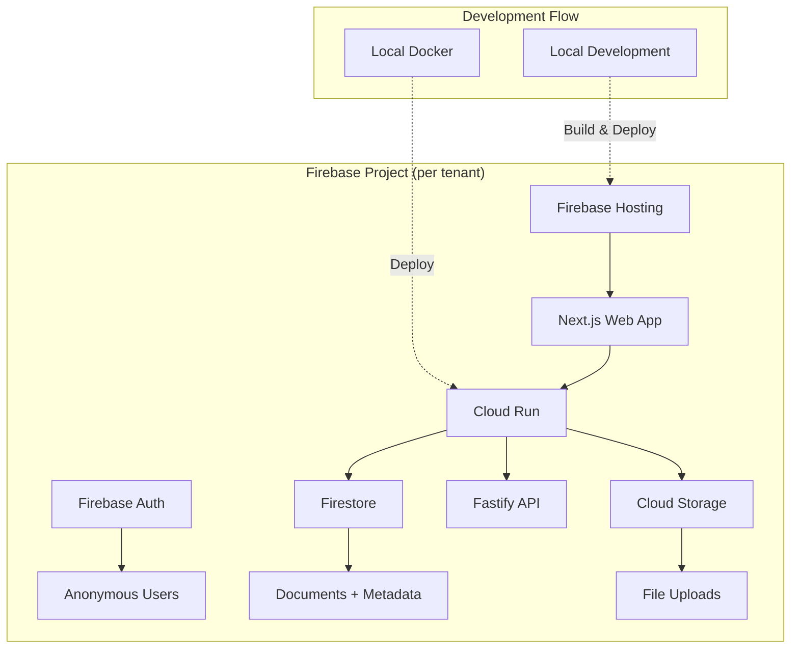

# Firebase Deployment Guide for Zenithfall

This guide walks you through deploying Zenithfall to Firebase/GCP using the infrastructure we've created.

## 🎯 What We've Built

### ✅ Completed Components

1. **Firebase Configuration Management** (`packages/shared/src/config/`)
   - Comprehensive Firebase configuration types
   - Region-aware setup (defaults to Germany for GDPR compliance)
   - Tier-based feature and resource allocation

2. **Environment Detection Service** (`packages/shared/src/services/`)
   - Automatic detection of local vs Firebase environments
   - Hybrid configuration management
   - Tenant-specific settings

3. **Terraform Infrastructure** (`infrastructure/terraform/`)
   - Reusable Firebase tenant module
   - Zenithfall-specific deployment configuration
   - German region optimization (europe-west3)

4. **Automated Deployment Script** (`scripts/deploy-zenithfall-firebase.sh`)
   - Complete end-to-end deployment automation
   - Prerequisites checking
   - Infrastructure + application deployment

## 🚀 Quick Start Deployment

### Prerequisites

1. **Install Required Tools:**
   ```bash
   # Install Terraform
   # Download from: https://terraform.io/downloads

   # Install Google Cloud CLI
   # Download from: https://cloud.google.com/sdk/docs/install

   # Install Firebase CLI
   npm install -g firebase-tools

   # Install Docker
   # Download from: https://docker.com/get-started
   ```

2. **Authenticate with Google Cloud:**
   ```bash
   gcloud auth login
   gcloud auth application-default login
   ```

3. **Get Your Billing Account ID:**
   - Go to: https://console.cloud.google.com/billing
   - Copy your billing account ID (format: `0X0X0X-0X0X0X-0X0X0X`)

### Deploy Zenithfall

1. **Run the Deployment Script:**
   ```bash
   ./scripts/deploy-zenithfall-firebase.sh YOUR_BILLING_ACCOUNT_ID
   ```

   Example:
   ```bash
   ./scripts/deploy-zenithfall-firebase.sh 01AB23-4CD567-89EF01
   ```

2. **The script will:**
   - ✅ Create a new GCP project for Zenithfall
   - ✅ Enable Firebase services (Auth, Firestore, Hosting)
   - ✅ Deploy API to Cloud Run (Frankfurt region)
   - ✅ Set up Firestore database with security rules
   - ✅ Deploy web app to Firebase Hosting
   - ✅ Configure container registry for future updates

3. **Set Your OpenAI API Key:**
   ```bash
   # After deployment, set your OpenAI API key
   echo "your-openai-api-key" | gcloud secrets versions add openai-api-key \
     --data-file=- --project=YOUR_PROJECT_ID
   ```

## 📁 Project Structure

```
cw-rag-core/
├── packages/shared/src/
│   ├── config/firebase-config.ts          # Firebase configuration types
│   └── services/
│       ├── environment-detector.ts        # Environment detection
│       └── configuration-service.ts       # Centralized config management
├── infrastructure/terraform/
│   ├── modules/firebase-tenant/           # Reusable tenant module
│   └── zenithfall/                        # Zenithfall-specific deployment
│       ├── main.tf                        # Main configuration
│       ├── terraform.tfvars.example       # Variables template
│       └── firebase-env.tpl              # Environment template
└── scripts/
    └── deploy-zenithfall-firebase.sh      # Deployment automation
```

## 🔧 Manual Deployment Steps

If you prefer to deploy manually or want to understand the process:

### 1. Configure Terraform

```bash
cd infrastructure/terraform/zenithfall

# Copy and edit the variables file
cp terraform.tfvars.example terraform.tfvars

# Edit terraform.tfvars with your billing account
# billing_account = "YOUR_BILLING_ACCOUNT_ID"
```

### 2. Deploy Infrastructure

```bash
# Initialize and deploy
terraform init
terraform plan
terraform apply

# Get the project ID
PROJECT_ID=$(terraform output -raw zenithfall_project_id)
```

### 3. Set Up Firebase

```bash
# Login and use the project
firebase login
firebase use $PROJECT_ID

# Deploy Firestore rules
firebase deploy --only firestore:rules,firestore:indexes
```

### 4. Build and Deploy Application

```bash
# Build and push API container
REGION="europe-west3"
REGISTRY="${REGION}-docker.pkg.dev/${PROJECT_ID}/rag-containers"

gcloud auth configure-docker "${REGION}-docker.pkg.dev"
docker build -t "${REGISTRY}/rag-api:latest" -f apps/api/Dockerfile .
docker push "${REGISTRY}/rag-api:latest"

# Update Cloud Run service
gcloud run deploy rag-api \
  --image="${REGISTRY}/rag-api:latest" \
  --region="$REGION" \
  --project="$PROJECT_ID"

# Build and deploy web app
cd apps/web
NEXT_PUBLIC_FIREBASE_PROJECT_ID="$PROJECT_ID" pnpm build
firebase deploy --only hosting --project="$PROJECT_ID"
```

## 🌍 Regional Configuration

### Default: Germany (GDPR Compliant)

- **GCP Region:** `europe-west3` (Frankfurt)
- **Firebase Location:** `eur3` (Europe multi-region)
- **Benefits:** GDPR compliance, low latency for EU users

### Alternative Regions

Edit `infrastructure/terraform/zenithfall/terraform.tfvars`:

```hcl
# US deployment
region = "us-central1"
firebase_location = "nam5"

# Asia deployment
region = "asia-northeast1"
firebase_location = "asia-northeast1"
```

## 🏗️ Architecture Overview



## 🔐 Security Features

### Firebase Authentication
- **Anonymous auth enabled** for development tier
- **Email/password auth** available
- **MFA support** for premium/enterprise tiers

### Firestore Security Rules
```javascript
// Users can only access their tenant's data
match /documents/{documentId} {
  allow read, write: if request.auth != null
    && resource.data.tenantId == request.auth.token.tenantId;
}
```

### IAM and Permissions
- **Service account** with minimal required permissions
- **Tenant isolation** through project separation
- **Secret management** via Google Secret Manager

## 💰 Cost Optimization

### Per-Tenant Billing
- Each tenant gets its own GCP project
- Isolated billing and cost tracking
- Easy to implement charge-back to customers

### Tier-Based Resource Allocation
```typescript
development: {
  cpu: "1",
  memory: "2Gi",
  max_instances: 5
}

basic: {
  cpu: "2",
  memory: "4Gi",
  max_instances: 10
}

premium: {
  cpu: "4",
  memory: "8Gi",
  max_instances: 25
}
```

## 🔄 Hybrid Development Workflow

### Local Development (Current)
```bash
# Continue using Docker for fast iteration
docker-compose -f docker-compose.zenithfall.yml up
```

### Cloud Testing
```bash
# Deploy latest changes to cloud for testing
./scripts/deploy-zenithfall-firebase.sh YOUR_BILLING_ACCOUNT
```

### Environment Detection
The system automatically detects and configures based on environment:

```typescript
// Automatically chooses the right backend
if (EnvironmentDetector.isFirebaseEnabled()) {
  // Use Firestore + Firebase Auth
} else {
  // Use local Qdrant + token auth
}
```

## 📊 Monitoring and Operations

### Firebase Console
- **Project Dashboard:** `https://console.firebase.google.com/project/PROJECT_ID`
- **Firestore Data:** Real-time database monitoring
- **Authentication:** User management
- **Hosting:** Deploy history and logs

### Google Cloud Console
- **Cloud Run:** API service monitoring
- **Cloud Logging:** Centralized logs
- **Cloud Monitoring:** Performance metrics
- **Secret Manager:** Secure configuration

## 🚧 Next Steps

### Immediate (Ready to Deploy)
1. **Run deployment script** with your billing account
2. **Set OpenAI API key** in Secret Manager
3. **Test the deployment** end-to-end

### Phase 2 (Future Development)
1. **Firebase Authentication integration** in API
2. **Firestore hybrid search** implementation
3. **Vertex AI embeddings** integration
4. **Multi-language support**

### Phase 3 (Advanced Features)
1. **Custom domain setup** (zenithfall.yourcompany.com)
2. **Advanced monitoring** and alerting
3. **Backup and disaster recovery**
4. **Multi-region deployment**

## 🆘 Troubleshooting

### Common Issues

**Billing Account Access:**
```bash
# Check billing account access
gcloud billing accounts list
gcloud billing accounts describe YOUR_BILLING_ACCOUNT_ID
```

**API Enablement:**
```bash
# If deployment fails, check enabled APIs
gcloud services list --enabled --project=PROJECT_ID
```

**Container Registry Access:**
```bash
# Configure Docker authentication
gcloud auth configure-docker europe-west3-docker.pkg.dev
```

**Firebase Access:**
```bash
# Re-authenticate if needed
firebase logout
firebase login
```

### Getting Help

1. **Check the deployment logs** for specific error messages
2. **Verify prerequisites** are installed and authenticated
3. **Check billing account** has sufficient credits and permissions
4. **Review Firebase quotas** if hitting limits

## 🎉 Success!

Once deployed, you'll have:

- ✅ **Zenithfall running on Firebase** with your own domain
- ✅ **Scalable infrastructure** in German region (GDPR compliant)
- ✅ **Hybrid development** - local development, cloud deployment
- ✅ **Production-ready setup** with monitoring and security
- ✅ **Cost tracking** per tenant
- ✅ **Easy scaling** for future tenants

Visit your deployed app at: `https://PROJECT_ID.web.app`

**Happy deploying! 🚀**