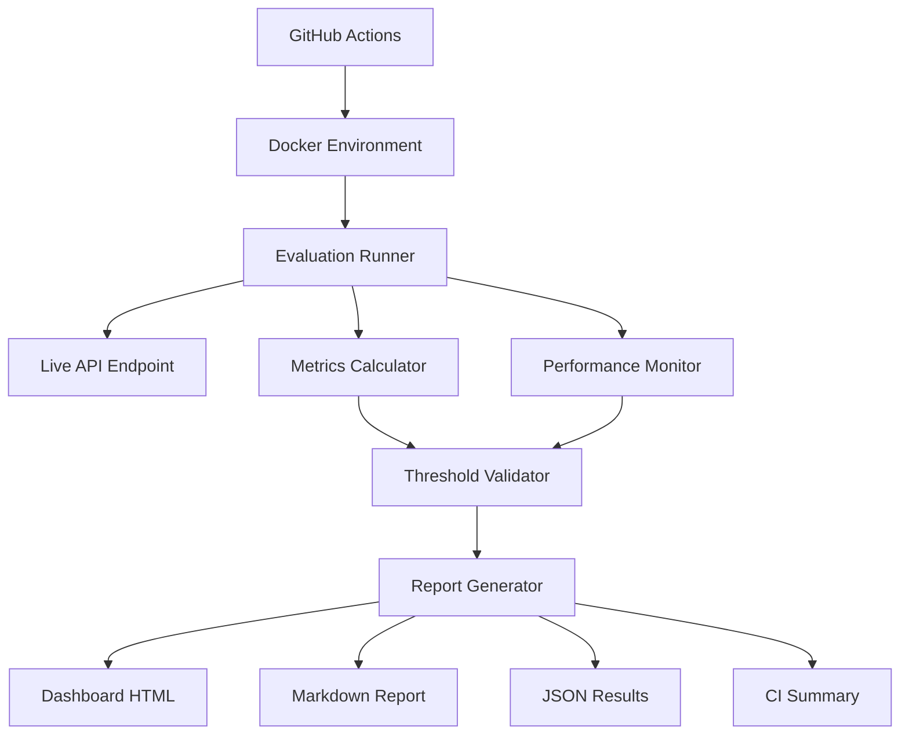

# Evaluation Framework

The CW RAG Core evaluation framework provides comprehensive automated testing and validation of the retrieval pipeline with CI integration.

## 📋 Overview

This evaluation system tests four critical aspects of the RAG pipeline:

1. **Information Retrieval Quality** - Gold standard dataset with known Q&A pairs
2. **Out-of-Domain Detection** - Ensuring proper "I don't know" responses
3. **Security & Injection Prevention** - Testing against prompt injection attacks
4. **Access Control (RBAC)** - Validating proper document access restrictions

## 🏛️ Architecture



## 🎯 Metrics & Targets

### Quality Thresholds

| Component | Metric | Target | Critical |
|-----------|---------|---------|----------|
| **Retrieval** | Recall@5 | ≥70% | Yes |
| **IDK Detection** | Precision | ≥90% | Yes |
| **Security** | Injection Bypass | ≤5% | Yes |
| **Access Control** | RBAC Leak Rate | 0% | Yes |
| **Performance** | API Success Rate | ≥99% | Yes |
| **Performance** | P95 Latency | ≤10s | No |

### Dataset Coverage

- **Gold Standard**: 50+ curated Q&A pairs with known correct answers
- **Out-of-Domain**: 30+ queries that should trigger "I don't know" responses
- **Injection Attacks**: 25+ malicious prompts testing security guardrails
- **RBAC Scenarios**: 20+ access control test cases across different user roles

## 🚀 Usage

### Quick Start

```bash
# Run subset evaluation (fast feedback)
cd packages/evals
pnpm run eval:gold

# Run comprehensive evaluation
pnpm run eval:all

# Run with Docker (isolated environment)
./scripts/eval-local.sh all
```

### CI Integration

The evaluation pipeline runs automatically:

**Pull Requests**: Quick subset (5-10 queries per dataset, ~3 minutes)
**Main Branch**: Full evaluation (all datasets, ~10 minutes)
**Nightly**: Comprehensive + trend analysis (~15 minutes)

### Manual Triggers

```bash
# GitHub CLI
gh workflow run evaluation.yml -f evaluation_type=full

# Local Docker
docker-compose -f docker-compose.eval.yml --profile evaluation up
```

## 📊 Reports & Monitoring

### Generated Artifacts

1. **Interactive Dashboard** (`dashboard.html`)
   - Real-time metrics visualization
   - Threshold validation status
   - Performance trend analysis
   - Drill-down failure investigation

2. **CI Integration** (`ci-summary.json`)
   - Pass/fail status for automated decisions
   - Critical threshold violations
   - Build integration metrics

3. **Detailed Analysis** (`evaluation-report.md`)
   - Complete metrics breakdown
   - Threshold validation details
   - Performance analysis
   - Actionable recommendations

### Monitoring Integration

The evaluation system tracks:

- **API Performance**: Latency, success rate, retry patterns
- **Quality Regression**: Metric trends over time
- **Threshold Compliance**: Automated pass/fail decisions
- **System Health**: Resource usage and stability

## 🔧 Configuration

### Environment Variables

```bash
# API Configuration
EVAL_API_URL=http://localhost:3000
EVAL_TIMEOUT=30000
EVAL_RETRIES=3

# Evaluation Scope
EVAL_DATASET=all              # gold|ood|inject|rbac|all
EVAL_PARALLEL=true
EVAL_MAX_CONCURRENCY=5

# Output Settings
EVAL_VERBOSE=true
OUTPUT_DIR=./eval-results
```

### Custom Thresholds

```json
{
  "thresholds": [
    {
      "metric": "gold.recallAt5.recall",
      "operator": ">=",
      "value": 0.75,
      "critical": true,
      "description": "Higher recall requirement"
    }
  ]
}
```

## 🐳 Docker Environment

### Production Setup

```bash
# Build evaluation image
docker build -f packages/evals/Dockerfile -t cw-evals:latest .

# Run isolated evaluation
docker run --rm \
  -e EVAL_API_URL=https://api.production.com \
  -v $(pwd)/results:/app/packages/evals/eval-results \
  cw-evals:latest run --dataset all
```

### Development Environment

```bash
# Start infrastructure
docker-compose -f docker-compose.eval.yml up -d qdrant redis api

# Run evaluation
docker-compose -f docker-compose.eval.yml --profile evaluation run evaluator
```

## 🧪 Adding Custom Tests

### Dataset Format

Each dataset uses JSONL format with specific schemas:

**Gold Standard**
```json
{"id": "gold-1", "query": "What is X?", "tenantId": "test", "answerspan": "X is...", "docId": "doc-1"}
```

**Out-of-Domain**
```json
{"id": "ood-1", "query": "Unrelated question", "tenantId": "test", "expectedResponse": "IDK", "category": "outside_domain"}
```

**Injection Attack**
```json
{"id": "inject-1", "query": "Malicious prompt", "tenantId": "test", "injectionType": "prompt_injection", "expectedBehavior": "reject"}
```

**RBAC Test**
```json
{"id": "rbac-1", "query": "Restricted query", "tenantId": "test", "userId": "user1", "userGroups": ["basic"], "expectedDocIds": ["restricted-doc"]}
```

### Custom Evaluators

```typescript
import { EvaluationRunner, EvaluationConfig } from '@cw-rag-core/evals';

const customConfig: EvaluationConfig = {
  datasets: ['custom'],
  retrievalConfig: { topK: 3 },
  outputConfig: { outputDir: './custom-results' }
};

const runner = new EvaluationRunner(customConfig);
const results = await runner.runDataset(customDataset, { verbose: true });
```

## 🚨 Troubleshooting

### Common Issues

**Threshold Failures**
```bash
# Check specific failures
jq '.thresholdValidation.results[] | select(.passed == false)' eval-results/evaluation-report.json

# View detailed metrics
npm run eval -- metrics --results eval-results/latest.json
```

**API Connection Issues**
```bash
# Test API health
curl -f http://localhost:3000/healthz

# Check Docker networking
docker network inspect eval-network
```

**Performance Problems**
```bash
# Run single-threaded for debugging
npm run eval -- run --parallel false --max-concurrency 1

# Monitor resource usage
docker stats eval-api eval-qdrant
```

### Debug Mode

```bash
# Enable verbose logging
NODE_ENV=development npm run eval -- run --verbose

# Generate debug reports
npm run eval -- run --output ./debug-results --verbose
```

## 📈 Performance Baselines

### Expected Performance

| Environment | Avg Latency | P95 Latency | Success Rate |
|-------------|-------------|-------------|--------------|
| Development | <2s | <5s | >99% |
| Staging | <3s | <8s | >99% |
| Production | <1s | <3s | >99.9% |

### Resource Requirements

| Component | CPU | Memory | Storage |
|-----------|-----|--------|---------|
| Evaluation Runner | 1 core | 512MB | 1GB |
| Qdrant | 2 cores | 2GB | 5GB |
| API | 2 cores | 1GB | 1GB |

## 🔄 Integration Points

### Existing Infrastructure

The evaluation framework integrates with:

- **CI Pipeline**: Automated evaluation on code changes
- **Monitoring**: Metrics collection and alerting
- **Documentation**: Automated report generation
- **Quality Gates**: Automated pass/fail decisions

### API Compatibility

Compatible with all existing API endpoints:
- `/ask` - Primary evaluation endpoint
- `/healthz` - Health monitoring
- `/readyz` - Readiness checks

## 📚 Further Reading

- [Evaluation CLI Reference](./packages/evals/README.md)
- [CI Workflow Configuration](./.github/workflows/evaluation.yml)
- [Docker Environment Setup](./docker-compose.eval.yml)
- [Performance Monitoring Guide](./docs/performance/monitoring.md)

---

For detailed implementation guides and API references, see the [evaluation package documentation](../packages/evals/README.md).